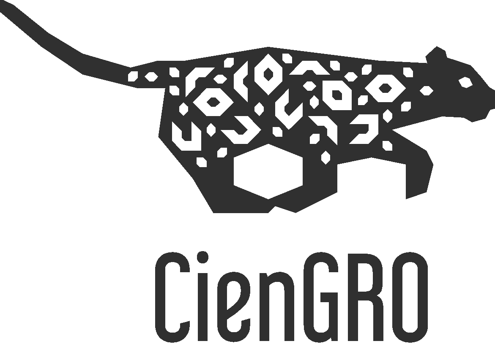

```{r setup, include=FALSE}
knitr::opts_chunk$set(echo = TRUE,message = FALSE,warning = FALSE)
```
# CIENGRO
## ¿Qué es CIENGRO?
- Es una comunidad de jóvenes Guerrerenses, en su mayoría estudiantes de posgrado,  que busca crear conciencia e impulsar el interés por la educación en todas las ciencias e ingenierías a través de la divulgación científica y técnica en la sociedad Guerrerense. 

```{r, echo=FALSE,out.width="60%",fig.align='center'}
   
```

## Misión y Visión

- Misión: Impulsar el avance de la sociedad guerrerense a través de ciencia de la más alta calidad y apoyar a los futuros líderes científicos, innovadores y emprendedores del estado mediante la creación de redes de talento comprometidas con el estado.
- Visión: Ser una comunidad de jóvenes líder que contribuya al bienestar a través de actividades y proyectos de impacto social, ambiental y económico para el desarrollo del estado de Guerrero.

# Introducción a R

## R

- Es un entorno y lenguaje de programación con un enfoque al análisis estadístico.

- Para descargar R debes acceder a CRAN https://cloud.r-project.org

- De preferencia trabajaremos con versiones > 3.5

## RStudio

- RStudio es un ambiente de desarrollo integrado (IDE) para programar en R. 

- Puedes descargarlo e instalarlo desde http://www.rstudio.com/download.


# Funciones Básicas

## Suma
```{r}
1 + 1
```

## Multiplicación
```{r}
10 * 10
```
## Logaritmo
```{r}
log10(100)
```
## Imprimir Texto
```{r}
"Hello World"
'Hello World'
```
## Histograma básico
```{r}
hist(npk$yield)
```
## Asignación de una variable
```{r}
test <- 1
2->test2
test = 1
x <- 3
x + 5
x<-x+5
```

# Instalación de paquetes
## CRAN (static version)
```{r,eval=FALSE}
install.packages("tidyverse")
library("tidyverse")
help(package = "tidyverse")
```

## Vector
```{r}
x<-c(1,3)
```

## Funciones
```{r}
add_two_numbers <- function(num1, num2) {
  final=log(num1+num2)
  return(final)
}
add_two_numbers(4,5)
```
### Ejemplo de función

¿Podrían escribir una función que calcule la media de 3 números? 
---

```{r}
Media3Numeros<-function(numero1,numero2,numero3=1000){
  Media<-(numero1+numero2+numero3)/3
  #Media<-mean(c(numero1,numero2,numero3))
  return(Media)
}
```

## Secuencias

```{r}
seq(0, 30) # This is the same as just `0:30`
x<-seq(0, 30, 2) # Every third number
```

## Función Módulo

```{r}
3%%2
seq(2,20)%%2
```
## Vectores de Strings

```{r}
animals <- c('mouse', 'rat', 'dog')
animals # Characters
```

## Función class

Conocer el tipo del vector

```{r}
class(animals)
```

## Función structure

Conocer más del vector

```{r}
str(animals)
```

## Concatenar 

Agregar elementos a un vector

```{r}
animals <- c(animals, "bear") # add to the end of the vector
animals <- c("owl", animals) # add to the beginning of the vector
animals
```

### Ejercicio

Pregunta: ¿Qué tipo de vector será?

```{r}
num_char <- c(1, 2, 3, 'a')
num_logical <- c(1, 2, 3, TRUE)
char_logical <- c('a', 'b', 'c', TRUE)
char_logical <- c('a', 'b', 'c', TRUE)
tricky <- c(1, 2, 3, '4')
#class(num_char)
#class(num_logical)
#class(char_logical)
#class(tricky)
```


# Referencias

- Hadley Wickman. R para Ciencia de Datos. https://es.r4ds.hadley.nz/